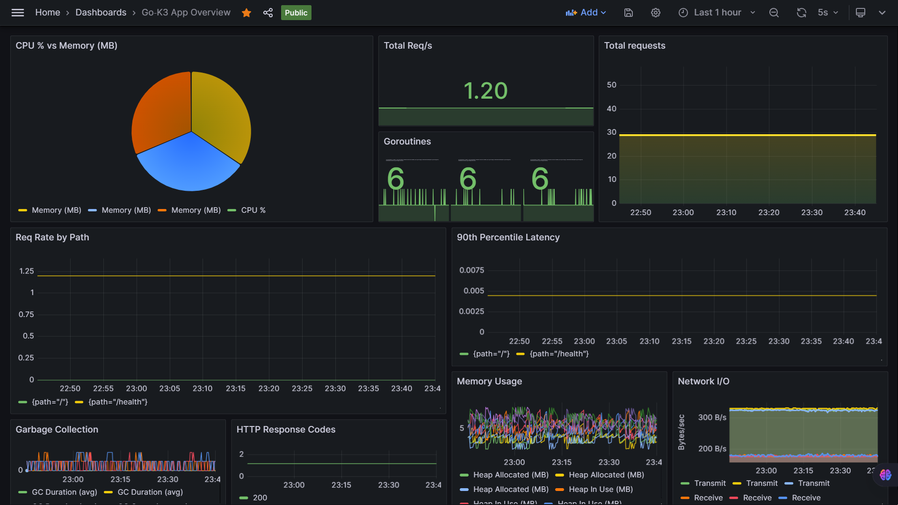

# KubeMicroServe - Lightweight Go Application for Kubernetes

A lightweight Go web server application ready to deploy on K3d/K3s Kubernetes clusters. This project demonstrates a simple but complete workflow for local Kubernetes development with Go.

## Overview

KubeMicroServe provides:
- A simple Go web server application
- Docker containerization
- Kubernetes deployment configurations
- Automated setup scripts for K3d/K3s clusters
- A streamlined development workflow using Make

For full setup and usage instructions, see [SETUP.md](SETUP.md).

## License

This project is licensed under the MIT License - see the [LICENSE](LICENSE) file for details.

## Acknowledgements

Main contributor: Mohit Nagaraj  
Supervisor: Tapomoy Adhikari

---

© Finessefleet Foundation, 2025. All rights reserved.